# Team EDA Survey — Preet, Erin, Jay, Isaac

*Compiled 2026-07-08. Scope: `sustag2/experiments/{preet,erin,jay,isaac}/`. This is a catalogue of the
exploratory data analysis each teammate produced for the Iowa waterborne-nitrate project, with the
relevant figures pulled into [`images/`](images/). Findings are quoted/traced to source files where
possible.*

Each contributor did EDA at different depths and from different angles:

- **Preet** — most comprehensive: multi-scale spatial features + regression **and** breach classification, spatial cross-validation.
- **Erin** — most statistically rigorous: a formal seasonality F-test and honest baselines that expose how hard persistence is to beat.
- **Jay** — most forecasting-oriented: classical time-series (Holt-Winters, Prophet) benchmarked against XGBoost, plus a cross-site transfer test.
- **Isaac** — mostly the shipped **modeling** pipeline (recipes + the exp6–16 ablation sweeps, documented separately in `notes/experiments*.md`); the standalone EDA is thin, but the fleet-wide autocorrelation and basin-size characterizations below are worth recording.

---

## TL;DR — what the independent analyses agree on

1. **Autocorrelation dominates.** Erin (persistence beats engineered features), Jay (`nitrate_lag1/2/3` are the top XGBoost features), Preet (baseline stream chemistry), and Isaac (fleet-wide ACF — nitrate stays autocorrelated across 50 days while rain is near white noise) all land here → validates the shipped recipes' cross-site nitrate lags.
2. **Nitrate transport is slow / subsurface.** Preet's 30-day-rain ≫ daily-precip is the mechanistic version of Jay's "monthly beats weekly" → supports rolling-window weather features over instantaneous precip.
3. **Spatial transfer is the hard part.** Preet (leave-one-cluster-out R² swings 0.09–0.43) and Jay (per-site MSE 0.006–67) independently show a single global model doesn't transfer uniformly — the exact LOSO/LOFO leakage gap the main pipeline is built around.
4. **Violations are seasonal and rare.** Erin (June = 30% of violations, F-test significant) and Jay (4.3% breach rate) agree → motivates PR-AUC / class-imbalance handling.

---

## Preet — `experiments/preet/`

**Notebooks:** `EDA_and_modeling.ipynb` (regression + spatial CV), `testing_stuff.ipynb` (~1500 lines, breach classification), `iowa_cdl.ipynb` (crop mapping), `gTREND_surplus.ipynb` (N-surplus).

**Data explored:** 85 sites (15-min → daily nitrate); N-surplus (county NASS 1930–2017, rasterized, **distance-decay weighted** at λ = 2 / 10 / 25 km); CDL crops 2000–2025 @ 1 km; full weather stack (precip, temp, RH, VPD, solar, ET, fuel-moisture) with 3–90 day rolling windows.

**Techniques:** distance-decay multi-scale spatial features (short 0–2 km, medium 2–10 km, long 10–25 km, with orthogonal delta-encoding to decouple nested scales), K-means site clustering (6 clusters) → **leave-one-cluster-out spatial CV**, collinearity diagnostics, class-balance/PR-AUC, iterative feature-importance refinement, outlier isolation.

### Key findings

- **Riparian primacy.** `w_Corn_short` (0–2 km) = **15.2%** importance, dominating medium/long-range corn: *"localized, immediate land cover (0 to 2 km buffer) exerts the primary structural pressure on baseline stream nitrate chemistry."* (`EDA_and_modeling.ipynb`)
- **Subsurface transport > runoff.** `rain_roll_30d` (5.3%) ≫ `precip_depth` (0.5%): *"nitrate primarily moves slowly through the soil profile and artificial tile-drainage networks rather than washing over the surface."*
- **Upstream dilution.** `w_Hay_Pasture_diff_long` (8.6%) and `w_Nonag_diff_med` (7.8%) carry real weight → non-agricultural upstream land acts as a dilution sink.
- **Spatial generalization gap.** Regression LOCO CV R² swings **0.09–0.43** across folds: *"a single, global XGBoost model struggles to transfer patterns to entirely unseen watersheds."*
- **Collinearity resolution.** r(local Corn, local Surplus) = 0.43 → delta-encoding removed the split dilution that had spread corn importance across three scale layers.
- **Extreme outlier.** `USGS-05480986` (~37 mg/L mean vs state median <5) isolated pre-training → improved transfer without hurting calibration.
- **Surplus data regime.** Post-2017 surplus is zero-filled; explicit `surplus_observed` binary flag added so the model distinguishes genuine zero from missing.
- **Urban surplus artifact.** County rasterization inflates urban surplus (DC 189, NYC 586–977 kg/ha) from tiny ag-pixel denominators; Iowa rural counties a realistic 5–50 kg/ha.

### Figures

**Feature importance — regression (left) and breach classifier (right).** Corn-short, rainfall lags, basin area dominate; the classifier leans on spring-rain and leaching-risk interactions.

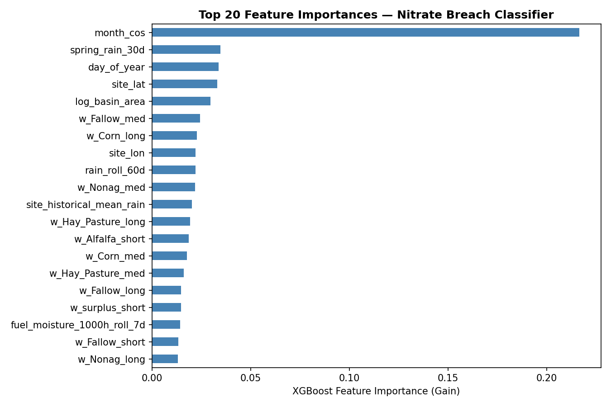
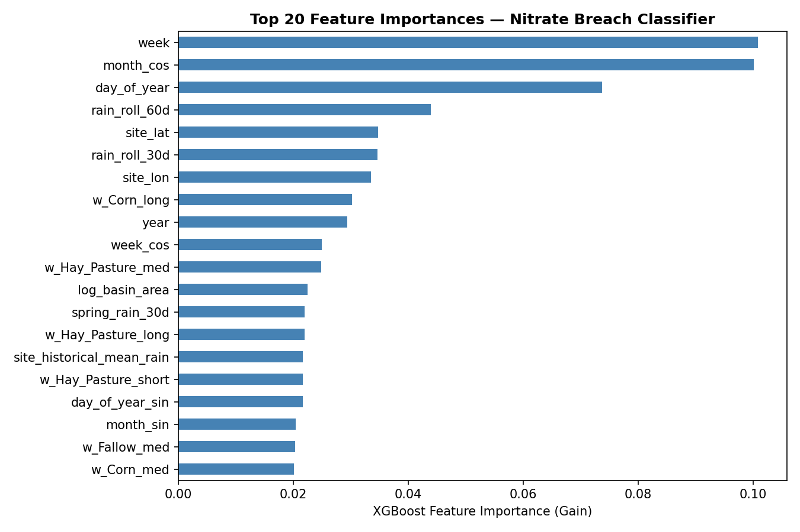

**Breach classification PR curves.** Spatial-CV mean PR-AUC **0.64 ± 0.04**, held-out geographic cluster **0.61** — calibration gap < 0.05.

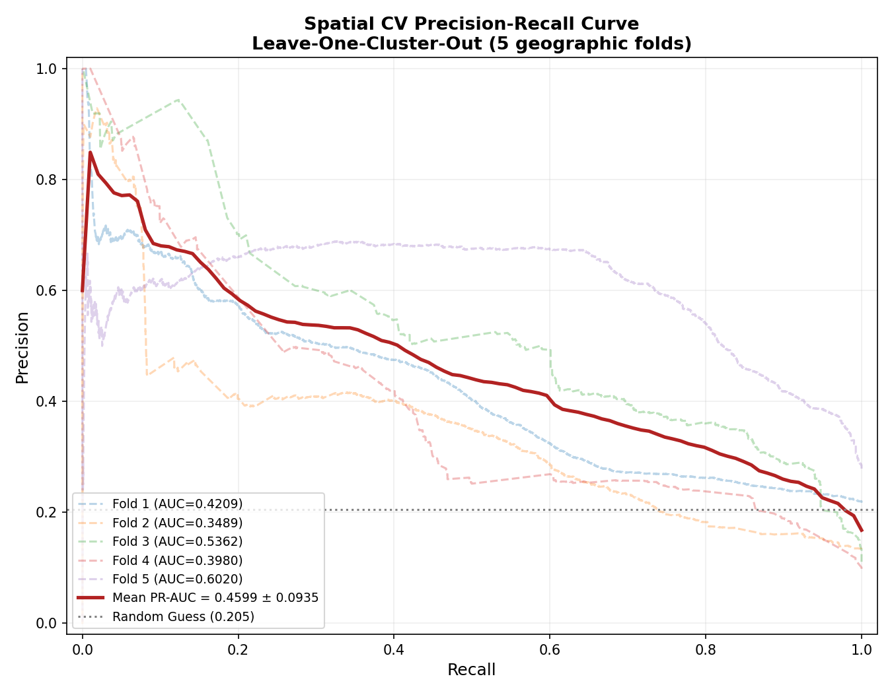
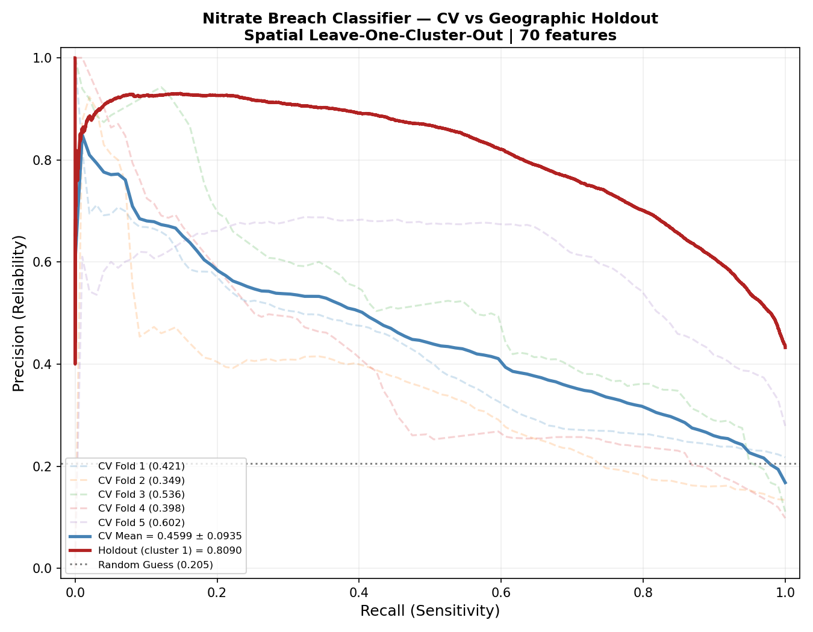

**Iowa crop composition, 2000–2025.** Corn ~41% / Soy ~33%, essentially flat over 26 years — land-use is a near-static predictor over the modeling horizon.

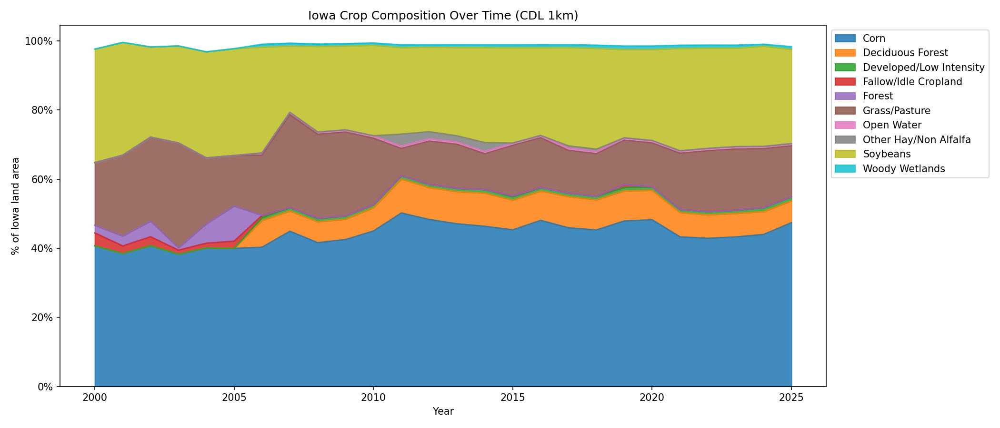
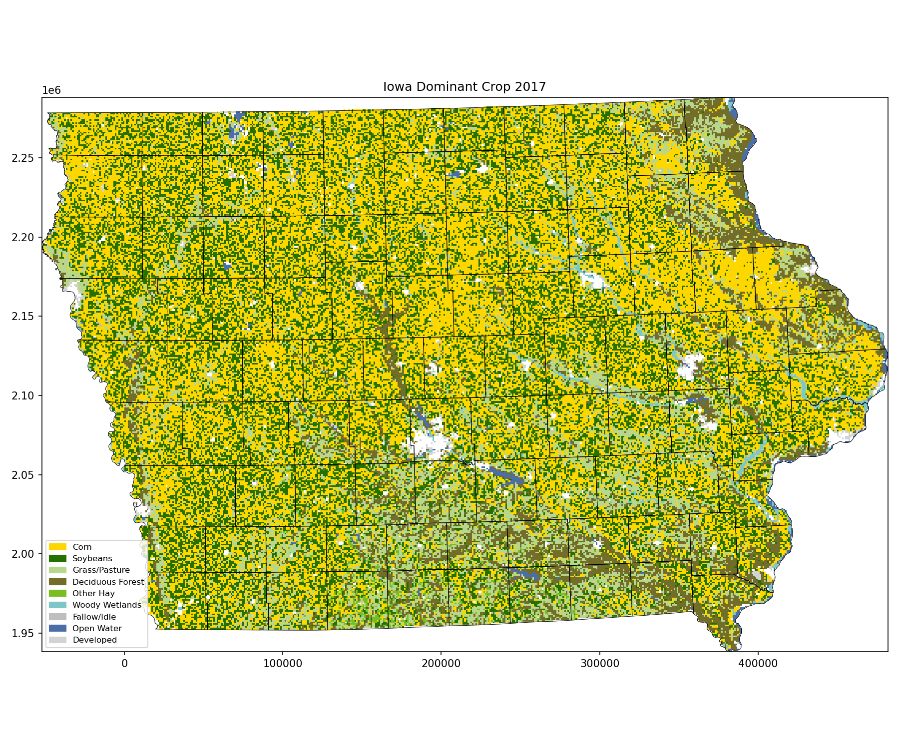
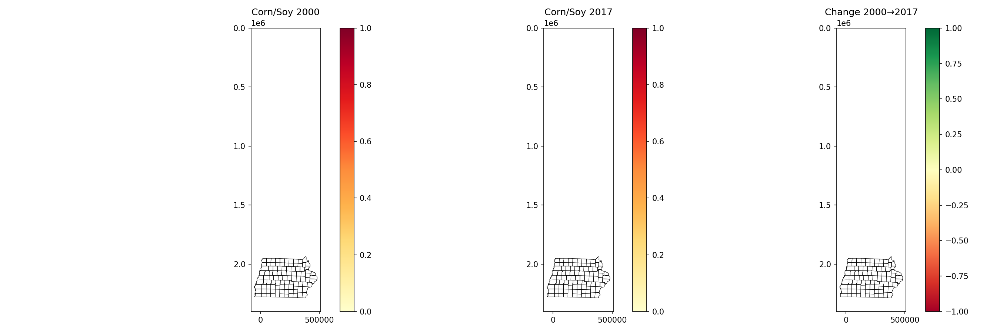

---

## Erin — `experiments/erin/`

**Notebooks/scripts:** `baseline_models.ipynb`, `seasonality_f_test.py`, `create_county_*.ipynb` (2017/2022 assembly), `county_level_fertilizer_data.ipynb`, `gTREND_surplus_gridded.ipynb`, `helper_functions.ipynb`, `map_script.py`, `rain_data.py`.

**Data explored:** county characteristics (NASS 2017/2022 census + USDA ERS demographics, 3,078 counties); fertilizer N by county 1950–2017; gridded gTREND surplus 250 m 2000–2017; IEM daily precip with 1/7/14/30-day rolls; DOY-collapsed seasonal profiles.

**Techniques:** **F-test for residual seasonality** (Fourier K=2, HAC-robust SEs), Durbin-Watson autocorrelation checks, leap-year DOY normalization, Plotly choropleth animations, honest time-series-CV baselines vs persistence.

### Key findings

- **Residual seasonality is real** (`ftest_diagnostics.png`). After controlling for rainfall, significant seasonal structure remains:
  - Nitrate concentration: F-test **p ≈ 0**, R² 0.940 → 0.967 (Fourier adds ~2.7% variance).
  - Violation-rate logit: **p ≈ 0**, R² 0.905 → 0.932.
  - Peak ~DOY 140–160 (May), trough Jan–Feb.
- **Strong autocorrelation.** Durbin-Watson **0.11** (nitrate) / **0.22** (violation) — far below 2 → HAC inference required, and an AR term is missing from the seasonal model.
- **Features "don't earn their keep" on a single site** (`baseline_models.ipynb`, WQS0039, 5-fold TS-CV, features = `nitrate_lag1` + `rain_x_surplus_7d`):
  - Classification (Average Precision): Gaussian random walk **0.830**, logistic regression **0.851** (only +2%), dummy 0.197.
  - Regression (MAE): persistence **0.501**, linear regression **0.524** — statistically indistinguishable.
  - Verbatim: *"features (rain, surplus) are not earning their keep."*
- **Violation seasonality.** June = **30%** of all violations; Apr–Jun + Oct = 60%; Aug–Sep minimal.

### Figures

**Seasonality F-test diagnostics.** Top row: DOY profiles for nitrate (R²=0.967) and violation-logit (R²=0.932), rainfall-only vs seasonal+rainfall overlays. Bottom: residual scatter vs DOY with the Durbin-Watson stats — visibly autocorrelated.

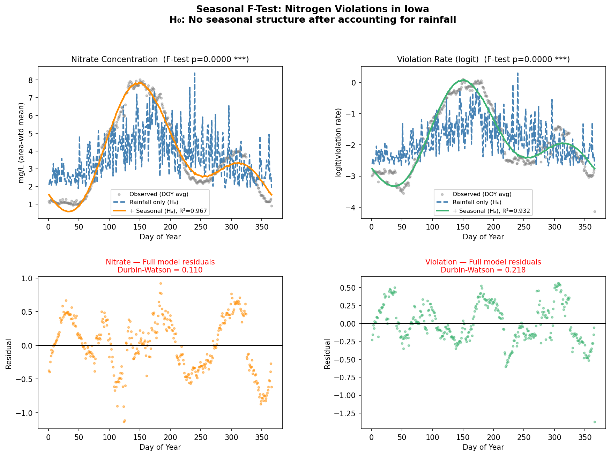

**Gridded nitrogen surplus, Iowa 2005 (250 m).** Hotspots NW, south-central, and SE — the corn-belt intensive row-crop + manure regions.

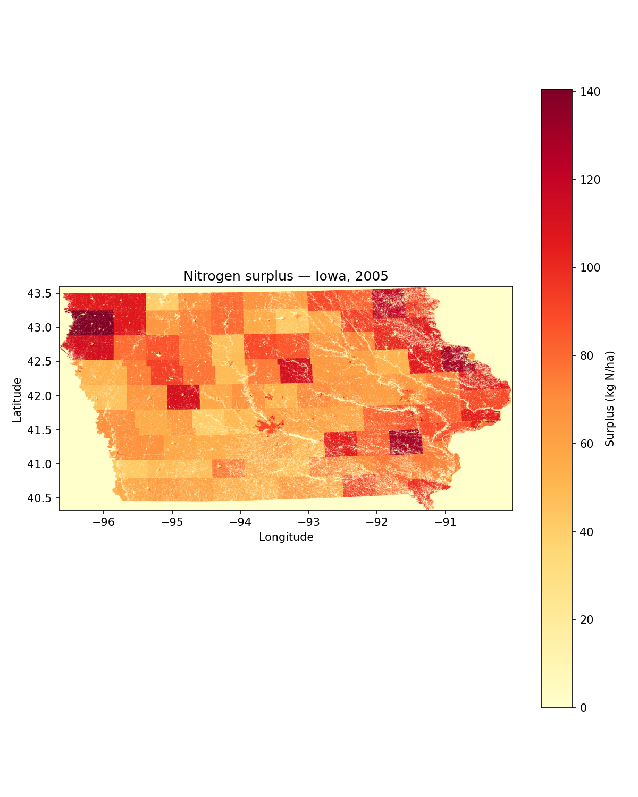

---

## Jay — `experiments/jay/`

**Notebooks:** `fetch_iowa_nasa_power.ipynb` (weather fetch), `regression_first_attempt.ipynb`, `seasonal_modeling.ipynb` (5 MB — the bulk; figures below extracted from its inline outputs).

**Data explored:** NASA POWER weather 2012–2025 (T2M, precip, wind; 0.5°×0.625° grid, 96 cells, ~11.8 M hourly rows); nitrate daily mean & max; rain×surplus interaction (7/14/30-day); nitrate lags 1–3.

**Techniques:** time-series decomposition (Holt-Winters seasonal, Prophet yearly), daily→weekly→monthly aggregation, 5-fold TS-CV, single-site → multi-site transfer test.

### Key findings (all from `seasonal_modeling.ipynb`, site WQS0083 unless noted)

- **XGBoost crushes classical time-series.** Single-site CV MSE **0.48 ± 0.55** vs Holt-Winters **14.2 ± 7.6** and Prophet **11.2 ± 6.7** — ~23× better → the signal is strongly nonlinear / interaction-driven.
- **Monthly > weekly** for both HW and Prophet (HW monthly MSE 4.98 vs weekly 6.95).
- **Prophet regressors *hurt*.** Adding precip + rain×surplus raised test MSE (5.77 vs ~6 baseline) — overfitting on limited monthly samples.
- **Transfer is site-dependent.** XGBoost trained on WQS0083, tested on 82 sites → mean MSE **5.27 ± 12.18** (best 0.006, worst 66.96).
- **Autocorrelation dominates.** Top XGBoost features are `nitrate_lag1/2/3`.
- **Violation rarity.** WQS0083: 125 / 2,881 days (**4.3%**) over 10 mg/L.
- **Aggregation caveat** (verbatim): *"I used max so we could track violations, but might need to be average for a continuous model. This could explain why linreg is so bad."*
- **Linear baseline** (`regression_first_attempt.ipynb`, USGS-05482500): R² 0.220, RMSE 4.55; strong negative `Year` coeff (−9.67); precip coeff ≈ −0.085 (weak).

### Figures

**Raw nitrate signal, WQS0083 (2019–2026).** Clear recurring spring peaks — the seasonal structure Erin's F-test formalizes.

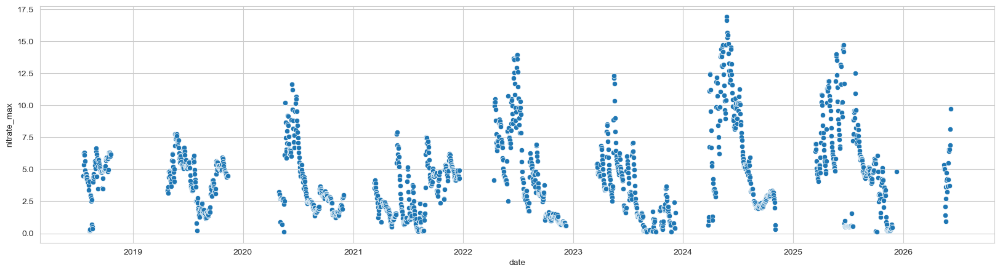

**Holt-Winters: monthly (MSE 4.98) vs weekly (MSE 6.95).** Weekly is noisier and worse — monthly seasonality carries the signal.

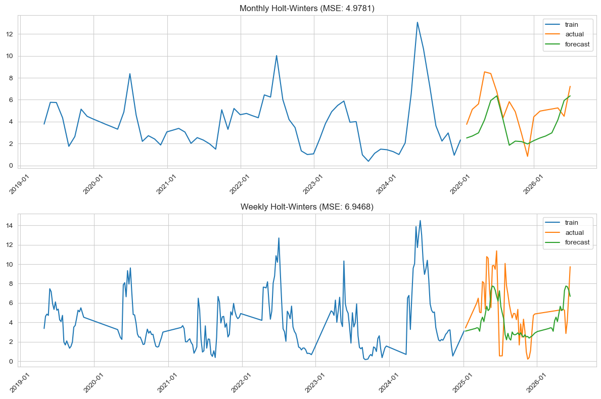

**XGBoost transfer — 4 sample sites.** Model trained on WQS0083 applied to unseen sites; fit quality varies by site.

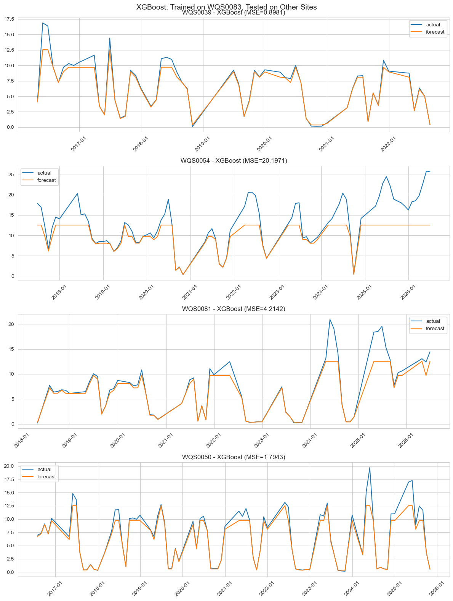

**XGBoost transfer — all 82 sites.** The wide spread (MSE 0.006 → 67) is the visual case that local hydrology/land-use overrides a single global model — i.e. why leakage-aware cross-site CV matters.

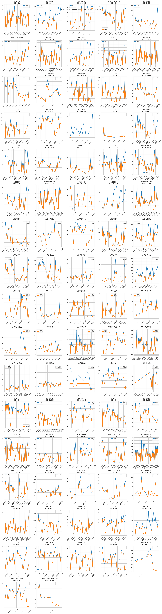

---

## Isaac — `experiments/isaac/`

**Caveat:** this directory is overwhelmingly the shipped **modeling** pipeline (`recipes*.py`, `cook.py`, and the exp6–16 recipe/hyperparameter sweeps captured in `notes/experiments*.md`) — those are not EDA and are documented elsewhere. What genuine data-characterization exists is thin, but four items are worth recording.

### Key findings

- **Fleet-wide autocorrelation** (`timeseries-tests.ipynb` → `graphs/autocorrelation_of_rain_sites.png`). ACF of daily nitrate at ~85 sites, 50-day lags: at nearly every site the nitrate ACF stays strongly positive and decays *slowly* across the full window, while rainfall is essentially white noise. This is the direct empirical basis for "autocorrelation dominates" — the target carries weeks of memory, rain does not.
- **Basin-size audit** (`graphs/basin_audit.png`). Distribution of preferred-basin area and grid-node count across the fleet: heavily right-skewed — ~50 basins under ~1,000 km² with a long tail to ~35,000 km² (and grid-node counts from a handful to >2,000). Quantifies the scale heterogeneity that makes cross-site transfer hard and explains why `basin_area` / `dist_to_sensor` rank high in importance.
- **Seasonal nitrate–rainfall co-occurrence** (`archive/rain_water_baselines.ipynb`, single site WQS0038). Day-of-year climatology (mean + per-year overlays) shows a spring/early-summer nitrate spike (~DOY 75–100) co-occurring with higher rainfall and the corn-planting/fertilizer window. Single-site and framed as the seasonality confound to *control for* (per `advice1.md`), not a novel discovery — but consistent with Erin's F-test and Jay's seasonal signal.
- **Data availability / violation-rate characterization** (`notes/advice1.md`). Per-site 7-day-window violation rates for candidate baseline sites: WQS0071 (245 windows, 21%), WQS0102 (137, 28%), WQS0070 (183, 21%), USGS-06603750 (55, **91%** → degenerate). Flags sparse event counts (~50–130 windows) as an overfitting risk and selects WQS0071 as a balanced single-site baseline.

### Figures

**Fleet-wide nitrate autocorrelation (~85 sites, 50-day lags).** Nitrate stays strongly autocorrelated across the whole window; rain is near white noise — the visual case for the target's memory.

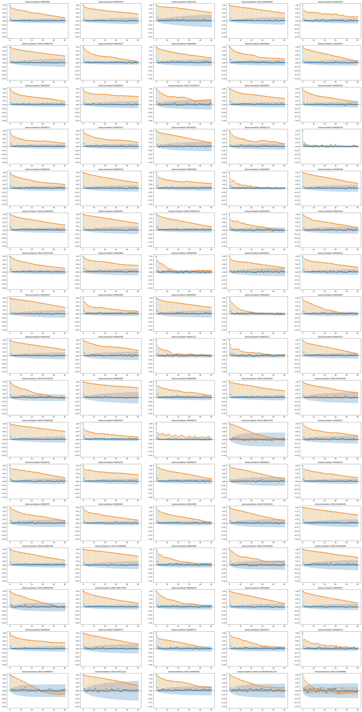

**Basin-size audit.** Preferred-basin area (left) and grid-node count (right) — both heavily right-skewed, quantifying the site heterogeneity behind hard spatial transfer.

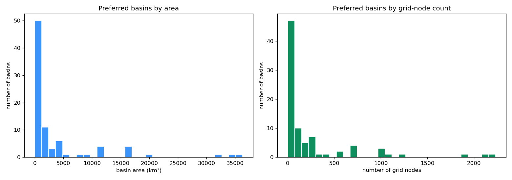

---

## Cross-cutting synthesis

**Convergent signals (strong triangulation for the main model's design):** the four TL;DR points above — autocorrelation dominance, slow subsurface transport, hard spatial transfer, seasonal + rare violations — were each reached independently by two or three teammates.

**Unique contributions not in the shipped pipeline:**

- **Erin's seasonality F-test** — the only *formal statistical test* that residual seasonality survives rainfall control (with HAC correction). A rigor level nobody else reached.
- **Preet's distance-decay multi-scale spatial features** (short/medium/long buffers + orthogonal delta-encoding) and K-means leave-one-cluster-out CV — a more elaborate spatial scheme than the shipped grid-based one.
- **Preet's urban-surplus data-quality catch** — relevant if surplus is ever extended nationally.
- **Jay's HW/Prophet-vs-XGBoost bake-off** — the clearest single artifact showing *why* the project chose trees over classical time-series.

**Tensions worth flagging:**

- Erin's "features don't beat persistence" (single-site) vs Preet/Jay's XGBoost wins — reconciled by scope: persistence is near-unbeatable *within one gauged site*, but the deployable goal is transfer to *ungauged* basins, where there is no site history to persist. (Same reason `persist_skill` is a gauged-site-only metric.)
- Jay's max-vs-mean nitrate aggregation doubt is a real methodological fork the main pipeline resolved (daily target, window=1).

---

## Figure index

All figures live in [`images/`](images/), prefixed by author.

| File | Source | Shows |
|---|---|---|
| `preet_feature_importance.png` | preet/EDA_and_modeling.ipynb | Regression XGBoost top features |
| `preet_feature_importance_breach.png` | preet/testing_stuff.ipynb | Breach-classifier top features |
| `preet_pr_curve_spatial_cv.png` | preet/testing_stuff.ipynb | PR curves, 5-fold spatial CV |
| `preet_pr_curve_final.png` | preet/testing_stuff.ipynb | PR curves + held-out cluster |
| `preet_crop_composition_stacked.png` | preet/iowa_cdl.ipynb | Iowa crop composition 2000–2025 |
| `preet_crop_map_2017.png` | preet/iowa_cdl.ipynb | 1 km CDL crop map, 2017 |
| `preet_corn_soy_change.png` | preet/iowa_cdl.ipynb | Corn–soy change map |
| `erin_ftest_diagnostics.png` | erin/seasonality_f_test.py | Seasonality F-test 4-panel diagnostics |
| `erin_surplus_2005.png` | erin/gTREND_surplus_gridded.ipynb | 250 m N-surplus raster, 2005 |
| `jay_nitrate_timeseries_wqs0083.png` | jay/seasonal_modeling.ipynb | Raw nitrate scatter, WQS0083 |
| `jay_holtwinters_monthly_vs_weekly.png` | jay/seasonal_modeling.ipynb | Holt-Winters monthly vs weekly |
| `jay_xgb_transfer_4sites.png` | jay/seasonal_modeling.ipynb | XGBoost transfer, 4 sample sites |
| `jay_xgb_transfer_allsites.png` | jay/seasonal_modeling.ipynb | XGBoost transfer, all 82 sites |
| `isaac_autocorrelation_rain.png` | isaac/timeseries-tests.ipynb | Fleet-wide nitrate ACF, ~85 sites |
| `isaac_basin_audit.png` | isaac/graphs | Basin-size distribution (area + grid nodes) |
